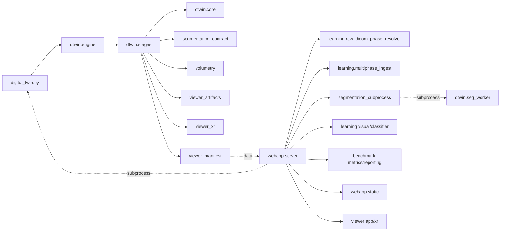

# Mapa de dependências

VERIFICAÇÃO 2026-08-17 (TASK-2026-08-17-PH01-CARTO-04): os 20 edges estáticos do grafo/tabela abaixo foram conferidos por import real no snapshot `9683eaa` — todos VERIFIED. Os 6 runtime-only edges foram provados na wave 3 (`RUNTIME_EDGES.md`, evidência file:line). As cadeias científicas foram cruzadas com `SCIENTIFIC_CONTRACTS.yaml` na wave 3 (15 MATCH, 2 CONFLICTs pré-existentes confirmados). Module cards: 259 paths citados, todos existentes. Script de verificação: `evidence/PH01/ph01_depmap_check.py`.

## Tipos

- STATIC: Python/JS import.
- RUNTIME: subprocess, HTTP, Docker, filesystem discovery.
- DATA: artifact read/write.
- SCIENTIFIC: resultado depende de contrato/config mesmo sem import direto.

## High-level graph

## File/module table

| Producer/importer | Imports/calls | Imported/consumed by | Artifacts |
|---|---|---|---|
| `dtwin/core.py` | SimpleITK, YAML, NumPy | engine, stages, most subsystems | Case paths, image I/O, hashes |
| `dtwin/engine.py` | stages, profile | CLI | stage artifacts |
| `dtwin/stages.py` | core, segmentation contract, volumetry, viewer artifacts/XR | engine/CLI/web subprocess | NIfTI, masks, VTP/STL, PNG, manifests |
| `raw_dicom_phase_resolver.py` | pydicom, filesystem | multiphase ingest/web | resolved phase tree/receipt |
| `multiphase_ingest.py` | pydicom, SimpleITK | web, learning/tools/tests | harmonized arterial/venous/delayed |
| `segmentation_subprocess.py` | subprocess/temp/runtime env | web, tools | masks/logs/status |
| `segmentation_shadow.py` | masks/SimpleITK | web | experimental approved mask/quality |
| `medsiglip_embeddings.py` | HF backend, configs, protocol hashes | classifiers/tools | `.npy`, checkpoint, manifest |
| classifier/splits | sklearn, protected labels/splits | training/evaluation | OOF predictions/bundles |
| benchmark metrics/reporting | models, atomic I/O | web/CLI/evaluators | JSON/CSV/Markdown |
| `volumetry.py` | SimpleITK/NumPy | stage7/tests | `volumetry_manifest.json/csv` |
| `viewer_artifacts.py` | image/mask/mesh | stage7 | QA/reference images/relationships |
| `viewer_xr.py` | PyVista/mesh metrics | stage7 | XR LOD assets |
| `webapp/server.py` | nearly all runtime boundaries | uvicorn/browser | jobs/reports/sessions/artifact API |

## Runtime-only edges that static import misses

- `webapp/server.py` invokes `digital_twin.py finalize` by subprocess.
- segmentation wrapper copies/invokes `dtwin/seg_worker.py`.
- candidate wrapper/worker use isolated TotalSegmentator runtime.
- MedGemma is HTTP via `dtwin-medgemma-v1`, often external/container/Ollama.
- viewer consumes manifest and assets through FastAPI/proxy rather than Python import.
- Compose connects argos, nginx, Neo4j and optional MedGemma.

## Scientific dependency chains

`protected labels → patient-grouped nested splits → inner preprocessing/tuning/threshold → outer OOF → failure accounting → metrics/CI`.

`DICOM tags/phase policy → physical volume/reference grid → mask → panel/embedding/classification AND volumetry/mesh/viewer`.

Any change in an upstream chain requires routing to every downstream consumer even when imports do not expose the edge.

