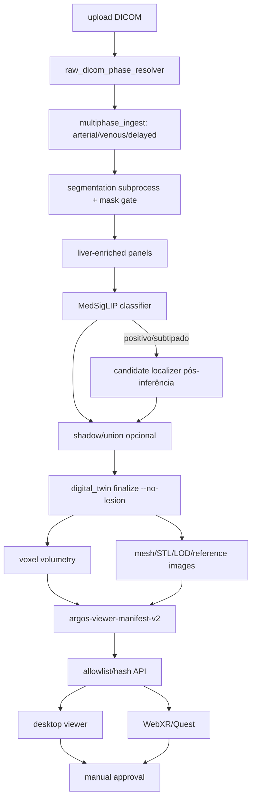

# Mapa real do sistema

Snapshot: commit `9683eaa…`. Graphify tinha 10.429 nós/27.519 arestas/597 comunidades, porém fora construído no commit `fec93d77` e foi usado apenas como orientação; paths abaixo foram conferidos no código.

VERIFICAÇÃO 2026-08-17 (TASK-2026-08-17-PH01-CARTO-01): grafo regenerado em `9683eaa` com `--code-only`/sem rede → 7.644 nós/24.909 arestas/308 comunidades; os nós `code` (6.757) e `rationale` (855) são **idênticos** ao seed — zero drift de código; a diferença é que o seed continha 2.772 nós `document`. Todos os entrypoints da tabela abaixo foram verificados (existência + import) — ver `tasks/TASK-2026-08-17-PH01-CARTO-01_EVIDENCE.md`. Evidência nova: `webapp/seg_worker.py` é estaticamente órfão (runtime copia `dtwin/seg_worker.py`; ver linha "status incerto" abaixo).

## Entrypoints

| Entrada | Paths reais | Função |
|---|---|---|
| CLI `digital-twin` | `pyproject.toml`, `digital_twin.py` | doctor, prepare e finalize |
| Engine clássico | `dtwin/engine.py`, `dtwin/stages.py` | sete estágios de DICOM a publicação |
| FastAPI | `webapp/server.py` | exame, benchmark, jobs, artifacts, review e XR |
| Frontend | `webapp/static/index.html`, `benchmark.html`, `argos.css`, `oren-motion.js` | upload/status/resultados |
| Viewer desktop | `viewer/index.html`, `app.js`, `argos-viewer.css` | 2D/3D, medidas, clipping, review |
| WebXR | `viewer/xr.js`, `webapp/static/quest/` | Quest/MR, hand controls e sessões |
| Docker | `compose.yaml`, `compose.portable.yaml`, `docker/`, `INICIAR_OREN.cmd` | argos, proxy, Neo4j e perfil MedGemma |
| Research CLIs | `tools/` | 307 scripts operacionais/experimentais/verificadores |

## Fluxo CLI clássico

```mermaid
flowchart LR
  D["DICOM MR"] --> S1["stage1_ingest"]
  S1 --> S2["stage2_normalize"]
  S2 --> S3["stage3_segment_organ"]
  S3 --> S4A["stage4a_prepare_lesion"]
  S4A --> H["máscara manual / --no-lesion"]
  H --> S4B["stage4b_import_lesion"]
  S4B --> S5["stage5_refine"]
  S5 --> S6["stage6_mesh"]
  S6 --> S7["stage7_export_publish"]
  S7 --> V["volumetry + manifests + STL/PNG/LOD"]
```

## Fluxo web multifásico atual

## Subsystems

- Core/geometry: `dtwin/core.py`.
- Orchestration/stages: `dtwin/engine.py`, `dtwin/stages.py`, `webapp/server.py`.
- DICOM/phase: `dtwin/core.py`, `dtwin/learning/raw_dicom_phase_resolver.py`, `multiphase_ingest.py`.
- Segmentation: `dtwin/segmentation_subprocess.py`, `seg_worker.py`, `segmentation_contract.py`, `segmentation_shadow.py`. (`webapp/seg_worker.py` REMOVIDO em 2026-08-20 — HUMAN_DECISIONS item 15.)
- Representation/inference: `dtwin/medgemma_panel*.py`, `dtwin/learning/exam_to_panels.py`, MedGemma/MedSigLIP modules.
- Evaluation: `dtwin/benchmark/` and `dtwin/learning/*classifier.py`.
- Knowledge: `dtwin/rag/`, `dtwin/graphrag/`, `dtwin/datasets/`.
- 3D/volume: `dtwin/volumetry.py`, `viewer_artifacts.py`, `viewer_xr.py`, stages 5–7.
- Storage: filesystem case directory via `dtwin.core.Case`; JSON/CSV/NPY/NIfTI/VTP/STL/PNG.
- Config: `profiles/figado.yaml`, 121 files under `configs/`, environment variables/Compose.
- Tests: 258 files/1.610 collected.

## Critical downstream reach

A mask change propagates to volumetry, meshes, QA, 2D references, Couinaud relationships, viewer manifest, API allowlist and WebXR. A representation/config change propagates to embeddings, cache, classifier scores, thresholds, OOF metrics and published reports. A DICOM phase/geometry change can affect every downstream artifact.

## Boundary warning

`dtwin/learning` and `dtwin/benchmark` are not purely offline research: the web runtime imports phase resolution, metrics, reporting, quality/timing and ML inference from them. Never delete namespaces in bulk.

