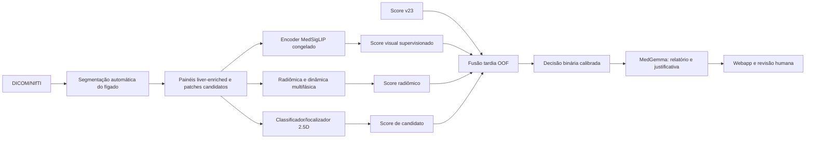

# ARGOS — Plano de ação para evolução do classificador visual

## 1. Finalidade

Este documento define a próxima linha de desenvolvimento do ARGOS após as
tentativas v23–v27. O objetivo é construir uma fonte nova e supervisionada de
informação visual, compatível com o hardware atual, e combiná-la de forma
controlada com o sinal já produzido pelo v23 e pelo MedGemma 1.5 4B.

Meta técnica:

```text
sensibilidade >= 75%
especificidade >= 75%
tempo end-to-end por exame <= 180 segundos
falhas técnicas e resultados inconclusivos contabilizados como erro
```

O plano não pressupõe que a meta será atingida. Ele define uma sequência
reproduzível para descobrir se existe sinal discriminativo suficiente nas bases
disponíveis, sem fabricar desempenho, reutilizar predições in-sample ou esconder
falhas.

## 2. Diagnóstico que orienta o plano

O MedGemma 4B reconhece muitos casos positivos, mas tende a transformar
alterações benignas, vasos, pseudolesões e variações anatômicas em suspeita
patológica. Isso produz boa sensibilidade em algumas coortes e especificidade
muito baixa em outras.

Resultados que orientam a estratégia:

- o v23 alcançou, no desenvolvimento restrito, aproximadamente 82,05% de
  sensibilidade e 79% de especificidade;
- o mesmo comportamento não se sustentou de modo equivalente na coorte
  ampliada;
- pathology-target e RAG textual não corrigiram isoladamente a saturação
  positiva do 4B;
- o zero-shot do MedSigLIP não foi suficiente como decisão final;
- linearidade, geometria vascular e características determinísticas forneceram
  sinal útil, mas ainda insuficiente e dependente da coorte;
- a limitação atual não é apenas de redação do prompt: falta um classificador
  visual supervisionado especificamente para separar patologia-alvo de
  mimetizadores benignos.

Portanto, a próxima arquitetura deve usar:

```text
representação visual MedSigLIP
+ características radiômicas e multifásicas
+ classificador de candidatos 2.5D
+ sinal histórico v23
→ fusão tardia calibrada
→ decisão binária
→ MedGemma para explicação estruturada
```

## 3. Restrições obrigatórias

### 3.1 Hardware

Ambiente de desenvolvimento:

- NVIDIA RTX 4060 Laptop com 8 GB de VRAM;
- aproximadamente 32 GB de RAM;
- Windows 11;
- MedGemma 1.5 4B local.

Consequências:

- treinamento completo do MedGemma não será realizado;
- QLoRA visual do MedGemma não é etapa inicial neste computador;
- MedGemma e treinamento visual não devem ocupar a GPU simultaneamente;
- os primeiros modelos devem usar embeddings congelados e classificadores
  leves;
- todo processamento longo deve possuir checkpoint atômico e retomada.

### 3.2 Metodologia

- divisão sempre por paciente/caso, nunca por painel ou corte;
- seleção de atributos, hiperparâmetros e limiar somente dentro dos folds de
  treinamento;
- métricas finais calculadas exclusivamente com predições out-of-fold;
- resultados já abertos são retrospectivos e não podem ser chamados de
  validação externa cega;
- máscaras de lesão podem ser usadas para treinamento/auditoria quando
  permitido, mas nunca na inferência;
- o holdout ou futura base independente deve permanecer fechado até o
  congelamento do candidato;
- falha técnica e `INCONCLUSIVA` contam como erro na métrica principal;
- nenhuma decisão pode ser retirada da métrica por encaminhamento à revisão
  humana;
- revisão humana continua obrigatória no uso de pesquisa.

### 3.3 Segurança

- nenhum DICOM bruto, NIfTI clínico, UID ou dado de paciente deve entrar no Git;
- identificadores devem ser anonimizados e, quando necessário, derivados por
  hash local;
- `data/`, artefatos de treino, pesos e caches permanecem ignorados;
- painel para modelo não pode conter PHI, ground truth ou máscara de lesão
  pré-marcada;
- caminhos enviados pelo navegador devem continuar limitados a configurações
  autorizadas no servidor.

## 4. Arquitetura-alvo



O MedGemma deixa de ser a única fonte da classificação. A decisão principal
passa a vir de sinais mensuráveis e calibrados. O MedGemma permanece como leitor
visual auxiliar e gerador de relatório, sem poder contradizer silenciosamente a
decisão do classificador híbrido.

## 5. Estrutura recomendada

Criar os componentes sem acoplar dependências de treinamento ao runtime atual:

```text
dtwin/learning/
  __init__.py
  schemas.py
  splits.py
  checkpoints.py
  candidate_dataset.py
  medsiglip_embeddings.py
  medsiglip_classifier.py
  radiomics_features.py
  radiomics_classifier.py
  patch_classifier.py
  fusion.py
  calibration.py
  evaluation.py
  runtime.py

configs/training/
  hybrid_v1_protocol.yaml
  medsiglip_frozen_v1.yaml
  radiomics_v1.yaml
  patch_2p5d_v1.yaml
  fusion_v1.yaml

tools/
  freeze_hybrid_training_protocol.py
  build_liver_candidate_dataset.py
  extract_medsiglip_embeddings.py
  train_medsiglip_classifier.py
  extract_candidate_radiomics.py
  train_radiomics_classifier.py
  train_candidate_patch_classifier.py
  evaluate_hybrid_classifier.py
  verify_hybrid_artifacts.py
```

Artefatos derivados devem ser gravados fora do Git, por exemplo:

```text
casos/qualification/hybrid_v1/
  protocol/
  splits/
  candidate_dataset/
  embeddings/
  radiomics/
  models/
  oof_predictions/
  evaluation/
  audit/
```

## 6. Fases de implementação

## Fase 0 — Estabilizar e versionar o estado atual

### Objetivo

Criar um ponto de partida verificável antes de introduzir treinamento
supervisionado.

### Ações

1. Inventariar arquivos modificados, não rastreados e artefatos locais.
2. Separar código/configuração/documentação de dados e resultados pesados.
3. Confirmar que `data/`, `casos/`, modelos, caches e credenciais estão
   adequadamente ignorados.
4. Registrar hashes das configurações v23–v27, scripts e relatórios usados no
   panorama atual.
5. Criar uma branch com prefixo `codex/` para o novo desenvolvimento.
6. Executar a suíte atual antes de qualquer alteração.
7. Registrar em documento:
   - commit-base;
   - ambiente Python/CUDA;
   - modelo e revisão do MedGemma;
   - modelo e revisão do MedSigLIP;
   - resultados históricos usados como referência.

### Gate

- estado atual reproduzível;
- testes existentes aprovados;
- nenhum dado sensível incluído no versionamento;
- baseline v23 identificável por configuração e hash.

## Fase 1 — Congelar o protocolo científico híbrido

### Objetivo

Impedir que a implementação seja ajustada repetidamente em função do resultado
final.

### Ações

1. Criar `configs/training/hybrid_v1_protocol.yaml`.
2. Definir o alvo binário:

```text
POSITIVO = lesão focal/patologia-alvo suspeita
NEGATIVO = normal + variante anatômica benigna + pseudolesão/artefato
```

3. Inventariar as coortes:
   - OpenSwissHCC;
   - LLD-MMRI;
   - LiverHccSeg;
   - CHAOS;
   - bases locais, apenas se seus rótulos e procedência forem documentados.
4. Registrar, por caso:
   - `case_id`;
   - `patient_group_id`;
   - `dataset_id`;
   - classe;
   - subtipo clínico;
   - disponibilidade de fases;
   - disponibilidade de máscara hepática;
   - disponibilidade de máscara de lesão;
   - falha técnica;
   - hash da fonte anonimizada.
5. Definir os folds externos antes da extração supervisionada.
6. Definir nested cross-validation:
   - outer folds para avaliação;
   - inner folds para seleção de atributos, hiperparâmetros e threshold.
7. Definir também leave-one-dataset-out sempre que houver classes suficientes.
8. Assinar o protocolo e persistir SHA-256.

### Contrato

O manifesto científico pode conter labels, mas não deve ser consumido pelos
módulos de inferência ou renderização. O extrator de imagens recebe apenas uma
visão label-blind do caso.

### Gate

- nenhum paciente aparece em mais de um fold externo;
- protocolo, folds e taxonomia possuem hashes;
- distribuição de classes e falhas está documentada;
- não existe leitura de labels pelo caminho de inferência.

## Fase 2 — Ambiente isolado de treinamento

### Objetivo

Adicionar dependências de aprendizado sem quebrar a execução clínica
experimental existente.

### Ações

1. Criar um extra opcional de dependências, por exemplo `training`.
2. Fixar versões de:
   - PyTorch compatível com a CUDA instalada;
   - Transformers;
   - scikit-learn;
   - pandas;
   - joblib;
   - PyRadiomics;
   - SimpleITK;
   - MONAI, somente para o estágio 2.5D;
   - PEFT, somente quando LoRA for autorizada.
3. Criar verificação de ambiente:
   - CUDA disponível;
   - VRAM;
   - espaço livre;
   - revisões locais dos modelos;
   - incompatibilidades de versão.
4. Impedir treino quando o gateway MedGemma estiver ocupando a GPU.

### Gate

- ambiente de runtime atual continua iniciando;
- ambiente de treinamento executa smoke test CPU e GPU;
- nenhuma dependência opcional vira requisito obrigatório do webapp.

## Fase 3 — Dataset de candidatos e patches

### Objetivo

Materializar entradas visuais reproduzíveis para classificação supervisionada.

### Ações

1. Reutilizar a segmentação automática do fígado e os painéis liver-enriched.
2. Produzir imagens limpas, sem contorno de lesão, texto clínico ou PHI.
3. Gerar:
   - painel global hepático;
   - tiles por fase/sequência;
   - patches de candidatos automáticos;
   - contexto 2.5D com 3 ou 5 cortes adjacentes.
4. Usar máscaras públicas de lesão apenas na etapa de treinamento para:
   - atribuir label ao patch;
   - medir recall do localizador;
   - distinguir candidato verdadeiro de mimetizador.
5. Incluir candidatos automáticos negativos e falsos positivos difíceis. Não
   treinar somente em crops perfeitos derivados da lesão, pois eles não existirão
   na inferência real.
6. Harmonizar tamanho, orientação, intensidade e canais multifásicos.
7. Manter `automatic_candidate=true/false` no manifesto.
8. Persistir cada caso transacionalmente, com checkpoint, hash e retomada.

### Schema mínimo

```json
{
  "case_id": "anon-id",
  "patient_group_id": "anon-group",
  "dataset_id": "dataset",
  "candidate_id": "candidate-001",
  "phase": "arterial",
  "slice_indices": [41, 42, 43],
  "automatic_candidate": true,
  "source_sha256": "sha256",
  "image_sha256": "sha256",
  "label_attached_after_extraction": true,
  "lesion_mask_used_for_training_label": true,
  "research_only": true
}
```

### Testes

- determinismo de crop, ordem e hash;
- ausência de PHI;
- ausência de máscara visual enviada ao modelo;
- separação por paciente;
- funcionamento com fases ausentes;
- candidatos fora do fígado rejeitados;
- retomada após desligamento;
- igualdade entre manifesto e arquivos;
- train/inference parity.

### Gate

- todos os casos elegíveis possuem entradas válidas ou falha explícita;
- nenhum artefato foi criado usando label antes da extração;
- patches automáticos cobrem o fígado e os candidatos previstos;
- falhas não são silenciosamente descartadas.

## Fase 4 — Embeddings MedSigLIP congelados

### Objetivo

Testar o sinal visual do MedSigLIP sem treinar o encoder.

### Ações

1. Fixar nome, revisão, processor, resolução e normalização do modelo.
2. Extrair embeddings do:
   - painel hepático global;
   - tiles por fase;
   - patches candidatos.
3. Usar lotes pequenos, mixed precision e processamento sequencial.
4. Descarregar o MedSigLIP da GPU antes de iniciar o MedGemma.
5. Armazenar embeddings sem labels no mesmo registro.
6. Registrar hash do modelo, processor, imagem e vetor.
7. Recusar reuso se qualquer hash mudar.

### Testes

- mesma imagem e configuração geram mesmo vetor dentro da tolerância definida;
- mudança de processor invalida o cache;
- vetores não contêm NaN/Inf;
- extração não ultrapassa o limite seguro de VRAM;
- labels não são necessários para executar o extrator.

### Gate

- cache completo e verificável;
- pico de VRAM preferencialmente abaixo de 7,5 GB;
- extração por exame compatível com o orçamento futuro de 180 segundos.

## Fase 5 — Classificador supervisionado sobre MedSigLIP

### Objetivo

Medir se os embeddings contêm sinal suficiente para separar patologia de
mimetizadores.

### Modelos

Ordem obrigatória:

1. regressão logística L2 com balanceamento de classes;
2. SVM linear calibrado;
3. regressão logística elastic-net;
4. HistGradientBoosting ou pequeno MLP somente se os modelos lineares mostrarem
   sinal real.

### Agregações a testar

- média dos patches;
- máximo;
- média dos `top-k`;
- concatenação controlada entre global e candidatos;
- pooling por fase.

MIL com atenção só deve ser introduzido depois que agregações simples forem
avaliadas.

### Avaliação

1. Treinar exclusivamente nos folds internos.
2. Selecionar hiperparâmetros e threshold no inner CV.
3. Produzir uma predição por caso do fold externo.
4. Consolidar um único arquivo OOF.
5. Reportar:
   - sensibilidade;
   - especificidade;
   - balanced accuracy;
   - ROC-AUC;
   - PR-AUC;
   - matriz de confusão;
   - IC 95%;
   - métricas por dataset e subtipo.

### Gate de continuação

O MedSigLIP supervisionado deve apresentar:

- desempenho OOF acima do acaso;
- pior eixo de sensibilidade/especificidade preferencialmente acima de 60%;
- estabilidade entre folds;
- sinal complementar ou superior ao v23.

Se não houver sinal, não avançar diretamente para LoRA. Auditar dataset, crops,
fases e localizador primeiro.

## Fase 6 — Radiômica e dinâmica multifásica

### Objetivo

Adicionar informação quantitativa que o encoder visual ou o MedGemma podem não
representar de forma estável.

### Atributos iniciais

- intensidade de primeira ordem;
- forma e volume do candidato;
- razão superfície/volume;
- esfericidade;
- textura limitada e pré-especificada;
- realce arterial relativo;
- wash-in e washout;
- diferença pré/arterial/portal/tardia;
- DWI/ADC quando disponíveis;
- distância até vasos;
- tubularidade/vesselness;
- continuidade entre cortes;
- estabilidade espacial entre fases;
- localização relativa no fígado.

### Regras

- configuração PyRadiomics congelada;
- discretização, spacing e interpolação documentados;
- nenhum conjunto amplo de atributos pode ser selecionado usando o fold de
  teste;
- geometria incompatível deve gerar flag ou falha, nunca valor fabricado;
- missingness deve ser explícita.

### Gate

- extração determinística;
- baixa taxa de falhas;
- atributos úteis apresentam estabilidade;
- ausência de leakage por máscara de lesão na inferência.

## Fase 7 — Classificador radiômico

### Modelos

1. regressão logística elastic-net;
2. gradient boosting como análise secundária;
3. modelo de árvore somente com controle rigoroso de complexidade.

### Regras

- normalização e imputação ajustadas apenas no treino;
- seleção de atributos dentro do inner CV;
- número de atributos limitado em relação ao número de casos;
- predições finais exclusivamente OOF.

### Gate

Continuar se o score radiômico:

- superar claramente o acaso;
- adicionar ganho ao MedSigLIP ou ao v23;
- não depender de um único dataset;
- mantiver comportamento aceitável em negativos benignos.

## Fase 8 — Localizador e classificador 2.5D

### Objetivo

Reduzir a diluição de pequenas lesões em painéis globais.

### Implementação compatível com 8 GB

1. Usar patches com 3–5 cortes adjacentes.
2. Usar fases como canais quando a geometria permitir.
3. Começar por uma CNN pequena ou backbone médico compacto.
4. Treinar em batch pequeno com AMP e gradient accumulation.
5. Avaliar separadamente:
   - recall do localizador;
   - falso candidato por fígado;
   - classificação do candidato;
   - agregação por exame.

### Uso das máscaras

Máscaras públicas de lesão podem supervisionar o localizador durante treino.
Na inferência, o localizador recebe somente imagem e máscara hepática automática.

### Gate do localizador

Antes de avaliar o classificador, exigir:

```text
recall de localização >= 85%
```

em avaliação OOF, com quantidade praticável de candidatos por fígado. Se o
localizador não encontra a lesão, melhorar o localizador antes de alterar o
classificador final.

## Fase 9 — Fusão tardia com o v23

### Objetivo

Combinar fontes complementares sem permitir leakage.

### Entradas permitidas

- score OOF v23;
- score OOF MedSigLIP supervisionado;
- score OOF radiômico;
- score OOF do classificador de patches;
- flags técnicas e de qualidade pré-especificadas.

### Métodos

1. média ponderada congelada;
2. regressão logística regularizada;
3. regras determinísticas pré-especificadas;
4. calibrador isotônico somente se houver amostra suficiente e sempre dentro do
   inner CV.

### Proibições

- não usar score in-sample;
- não escolher peso ou threshold no conjunto avaliado;
- não testar dezenas de combinações e publicar apenas a melhor;
- não excluir falhas ou inconclusivos;
- não usar nome do dataset como atalho para a classe.

### Ablations obrigatórias

```text
v23
MedSigLIP
radiômica
patch classifier
v23 + MedSigLIP
v23 + radiômica
MedSigLIP + radiômica
v23 + MedSigLIP + radiômica
fusão completa
```

### Gate de candidato válido

Uma fusão só avança se:

- sensibilidade OOF >= 75%;
- especificidade OOF >= 75%;
- melhora ou estabilidade clara frente ao v23 na coorte completa;
- não houver colapso sistemático em uma coorte;
- o resultado sobreviver às análises de robustez da fase seguinte.

## Fase 10 — Robustez e validação retrospectiva multicohort

### Avaliações

1. nested cross-validation por paciente;
2. repetição de CV estratificada com sementes congeladas;
3. leave-one-dataset-out;
4. bootstrap por paciente para IC 95%;
5. desempenho por:
   - normal;
   - variante anatômica;
   - pseudolesão/artefato;
   - lesão benigna visível;
   - HCC;
   - tamanho de lesão;
   - fase disponível;
   - qualidade;
   - origem do dataset.

### Relatórios

Produzir:

- `oof_predictions.jsonl`;
- `evaluation.json`;
- `metrics.csv`;
- `confusion_matrix.csv`;
- `subgroup_metrics.csv`;
- `ablation_report.md`;
- `model_card.md`;
- `limitations.md`.

### Interpretação

- se atingir 75/75 apenas no conjunto agregado, mas falhar em leave-dataset-out,
  o resultado é promissor retrospectivo, não generalização consolidada;
- se atingir 75/75 de forma estável no multicohort, o ARGOS alcança a meta
  interna retrospectiva;
- somente uma futura coorte independente, mantida fechada, poderá sustentar uma
  alegação externa.

## Fase 11 — Gate de tempo, memória e confiabilidade

### Objetivo

Garantir que ganho estatístico seja utilizável no fluxo real.

### Medição end-to-end

Cronometrar:

```text
ingestão
segmentação
renderização
localização
embeddings
radiômica
classificação
MedGemma
persistência
tempo total
```

### Critérios

- total por exame <= 180 segundos;
- pico de VRAM dentro do limite seguro;
- um modelo de GPU residente por vez;
- cache validado por hash;
- retomada após queda de energia;
- gravação atômica dos relatórios;
- falha parcial não produz resultado clínico final.

### Estratégias de otimização

- cache de embeddings;
- batch apenas dentro de um caso;
- early exit somente se predefinido e validado;
- descarregar encoder antes do MedGemma;
- paralelizar CPU apenas sem competir com segmentação;
- reutilizar máscara hepática verificada.

## Fase 12 — Integração no backend e webapp

Esta fase só começa após aprovação estatística e temporal.

### Runtime

Criar uma interface estável, por exemplo:

```python
class VisualPathologyClassifier:
    def predict(case_artifacts) -> HybridPrediction:
        ...
```

### Artefatos

```text
visual_evidence.json
hybrid_decision.json
medgemma_report.json
```

`hybrid_decision.json` deve registrar:

```json
{
  "schema_version": "dtwin-hybrid-v1",
  "target_condition": "focal_liver_lesion_suspicion",
  "prediction": "POSITIVE",
  "probability": 0.81,
  "threshold": 0.63,
  "component_scores": {
    "v23": 0.72,
    "medsiglip": 0.84,
    "radiomics": 0.77,
    "patch_classifier": 0.89
  },
  "model_bundle_sha256": "sha256",
  "input_manifest_sha256": "sha256",
  "technical_failure": false,
  "research_only": true,
  "human_review_required": true
}
```

### Fluxo

1. DICOM bruto;
2. validação e anonimização;
3. segmentação hepática;
4. painel liver-enriched e candidatos;
5. classificador híbrido;
6. MedGemma recebe imagens e evidências permitidas;
7. relatório final preserva a decisão e descreve divergências;
8. visualizador 3D;
9. revisão humana.

### Webapp

- adicionar modo autorizado `hybrid_supervised`;
- impedir envio de caminho de modelo arbitrário;
- exibir score, threshold, versão e avisos;
- mostrar discordância entre classificador e MedGemma;
- preservar modos atuais para comparação;
- benchmark e exame individual devem usar a mesma implementação.

### Gate

- testes ponta a ponta aprovados;
- comportamento baseline preservado;
- sem PHI ou label leakage;
- mesmo caso/configuração gera mesmos hashes e decisão;
- timeout e falhas são apresentados corretamente.

## Fase 13 — Fine-tuning parcial do MedSigLIP

Executar somente se embeddings congelados apresentarem sinal real, mas a fusão
ainda não atingir o objetivo.

### Estágios

1. treinar somente a cabeça;
2. liberar os últimos blocos do encoder;
3. aplicar LoRA nos últimos blocos visuais;
4. comparar tudo contra o baseline congelado nos mesmos outer folds.

### Restrições

- batch de 1–4;
- AMP;
- gradient accumulation;
- gradient checkpointing quando necessário;
- early stopping no inner CV;
- seeds congeladas;
- sem seleção pelo fold externo.

### Gate

Fine-tuning só é mantido se melhorar o resultado OOF e a robustez por dataset,
sem exceder o orçamento temporal/memória.

## Fase 14 — QLoRA do MedGemma

Não é recomendada como próxima etapa neste notebook.

Ela deve ser considerada apenas quando:

- houver GPU com pelo menos 16 GB, preferencialmente mais;
- existir conjunto de instruções imagem-resposta revisado;
- os splits estiverem congelados;
- houver evidência de que o erro é de interpretação e não de localização;
- o ganho puder ser comparado ao classificador híbrido.

Treinar apenas o decoder pode melhorar formato e linguagem, mas não garante
melhora da percepção visual. QLoRA não deve substituir a avaliação
supervisionada do sinal visual.

## Fase 15 — RAG e GraphRAG

RAG textual e GraphRAG permanecem componentes secundários.

### Uso adequado

- recuperar critérios radiológicos;
- explicar por que vaso ou pseudolesão não é massa;
- padronizar relatório;
- apresentar mimetizadores relevantes;
- apoiar revisão humana;
- guardar proveniência de evidências.

### Uso inadequado

- decidir a classe final sem sinal visual;
- recuperar casos do fold de teste;
- usar ground truth protegido na consulta;
- compensar uma lesão que não aparece no painel/candidato.

Multimodal retrieval por embeddings pode ser avaliado como score adicional,
desde que o índice de cada fold contenha somente casos de treinamento.

## 7. Matriz de decisão

| Resultado | Decisão |
|---|---|
| MedSigLIP congelado sem sinal acima do acaso | Auditar entradas e candidatos; não iniciar LoRA |
| MedSigLIP útil, mas abaixo de 75/75 | Combinar com radiômica e v23 |
| Radiômica não adiciona ganho OOF | Remover da fusão final |
| Localizador com recall abaixo de 85% | Corrigir localização antes da classificação |
| Fusão atinge 75/75, mas colapsa por dataset | Declarar resultado retrospectivo instável |
| Fusão atinge 75/75 e permanece estável | Integrar ao webapp e preparar validação independente |
| Tempo acima de 180 s | Otimizar antes da integração |
| Fine-tuning não supera encoder congelado | Manter modelo congelado |

## 8. Testes obrigatórios

### Unidade

- schemas e enums;
- splits por paciente;
- hashes e cache;
- normalização;
- agregação por candidato/caso;
- calibração;
- regras de falha;
- serialização do bundle.

### Segurança

- detector de PHI;
- ausência de UIDs brutos;
- label não acessível pelo extrator;
- máscara de lesão não acessível na inferência;
- caminhos do webapp restritos.

### Metodologia

- nenhum caso atravessa folds;
- pipeline de transformação ajustado apenas no treino;
- OOF completo e único por caso;
- mudança de protocolo invalida cache;
- falhas entram como erro.

### Integração

- DICOM até `hybrid_decision.json`;
- DICOM até `medgemma_report.json`;
- webapp e CLI produzem o mesmo contrato;
- modos antigos permanecem reproduzíveis;
- interrupção e retomada não duplicam casos.

### Desempenho

- pico de RAM e VRAM;
- tempo por etapa;
- lote completo;
- queda simulada de processo;
- arquivo parcial/corrompido;
- indisponibilidade do MedGemma;
- fase ausente ou geometria incompatível.

## 9. Definição de tentativa válida

Uma tentativa só é válida quando:

1. protocolo e folds foram congelados antes da avaliação;
2. todas as predições são OOF;
3. não houve leitura indevida de label ou máscara;
4. todos os casos elegíveis e falhas estão contabilizados;
5. threshold foi escolhido somente no treino;
6. sensibilidade e especificidade possuem IC 95%;
7. existe relatório por dataset e subtipo;
8. o tempo end-to-end foi medido;
9. código, configuração, modelo e artefatos possuem hashes;
10. o resultado pode ser reproduzido por outro computador.

## 10. Definição de sucesso

### Sucesso técnico interno

```text
sensibilidade OOF >= 75%
especificidade OOF >= 75%
tempo end-to-end <= 180 segundos
zero vazamento de ground truth
falhas e inconclusivos contabilizados como erro
```

### Sucesso científico retrospectivo

Além do gate anterior:

- estabilidade em CV repetida;
- resultado aceitável nas coortes relevantes;
- especificidade adequada em variantes/pseudolesões;
- documentação completa das limitações;
- comparação transparente com v23 e ablations.

### Sucesso externo definitivo

Exige futuramente:

- coorte independente não usada no desenvolvimento;
- protocolo e modelo congelados antes de abrir labels;
- avaliação única;
- métricas e IC 95%;
- descrição explícita da população e domínio.

Até essa validação, a formulação correta será “desempenho retrospectivo
multicohort”, e não desempenho clínico comprovado.

## 11. Ordem executiva resumida

```text
0. estabilizar e versionar
1. congelar protocolo, taxonomia e folds
2. criar ambiente de treinamento isolado
3. construir dataset label-blind de candidatos
4. extrair embeddings MedSigLIP congelados
5. treinar e avaliar classificador MedSigLIP OOF
6. extrair radiômica e dinâmica multifásica
7. treinar e avaliar classificador radiômico OOF
8. desenvolver localizador/classificador 2.5D se necessário
9. fundir somente scores OOF com o v23
10. executar robustez multicohort e ablations
11. validar tempo, memória, falhas e retomada
12. integrar candidato aprovado no backend/webapp
13. testar fine-tuning parcial/LoRA MedSigLIP apenas se justificado
14. avaliar QLoRA MedGemma somente em hardware adequado
15. adicionar GraphRAG como explicação/evidência, não como solução visual
```

## 12. Primeiro incremento recomendado

O primeiro ciclo de desenvolvimento deve encerrar ao final da Fase 5:

```text
protocolo congelado
+ dataset de candidatos verificado
+ embeddings congelados
+ classificador linear supervisionado
+ predições nested OOF
+ relatório comparativo contra v23
```

Esse ciclo é o investimento de menor risco e maior valor informativo. Ele
responderá objetivamente se o MedSigLIP contém sinal visual supervisionável para
o problema do ARGOS. Somente depois desse resultado devem ser adicionadas
radiômica, rede 2.5D, LoRA ou maior complexidade.

